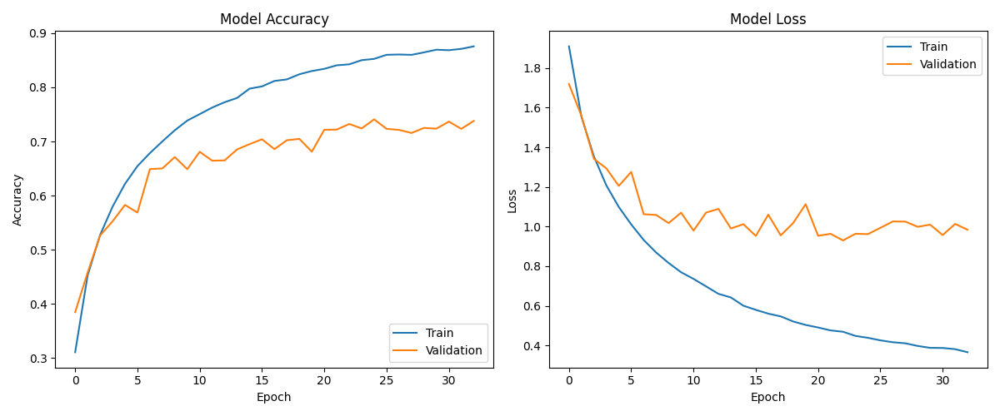
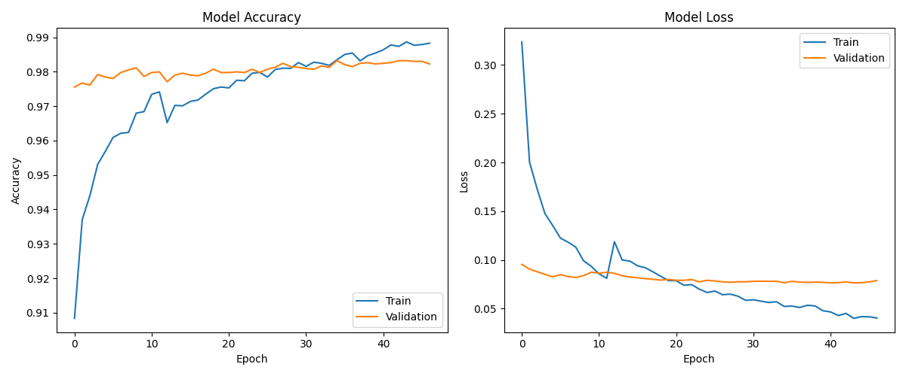
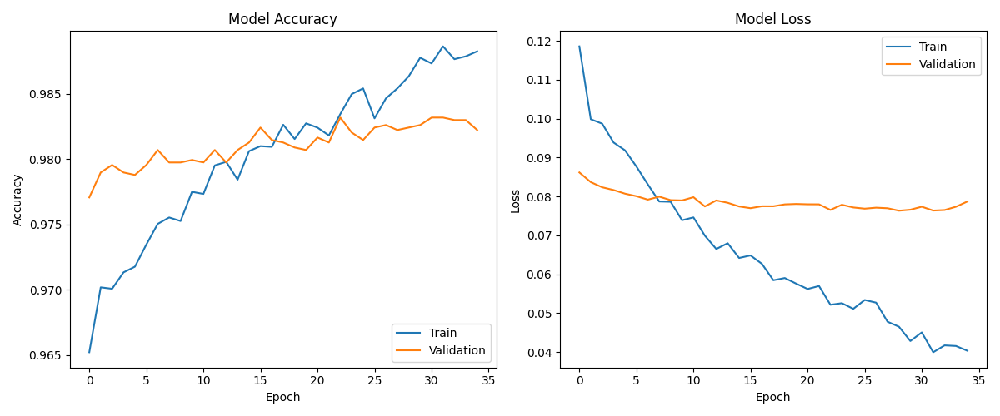
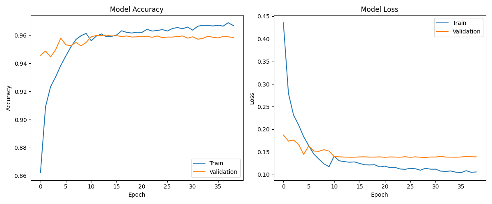

---
output:
  beamer_presentation:
    pdf-engine: xelatex
    listings: true
title: Image classification
author: Georg F.K. Höhn
short-author: Höhn
institute: Ironhack
date: 16 June 2025
section-titles: true
tables: true
indent: true
theme: default
colortheme: greenmeadow
bibliography: /home/georg/academia/BibTeXreferences/literature.bib
babel-lang: english
lang: en-GB
language: english
mainfont: Linux Biolinum
monofont: DejaVu Sans Mono
fontsize: 13pt
papersize: a4paper
numbersections: true
csquotes: true
---

## Overview

\tableofcontents

# Introduction

- Animals-10
  - dataset of 26179 images of animals in 10 classes
  - <https://www.kaggle.com/datasets/alessiocorrado99/animals10/data>

### Aims

Build image classification models for the 10 classes in the dataset

1) "manually" setting up convolutional neural networks from scratch
2) transfer learning from pre-trained models
3) compare performance metrics

# Data challenges

##

- category names encoded by folder structure
- no predetermined train-validation-test sets
- unbalanced category sizes

| Animal     |   Count |
|:-----------|--------:|
| butterfly  |    2112 |
| cat        |    1668 |
| chicken    |    3098 |
| cow        |    1866 |
| dog        |    4863 |
| elephant   |    1446 |
| horse      |    2623 |
| sheep      |    1820 |
| spider     |    4821 |
| squirrel   |    1862 |

## Formats

- some variation in formats
- some images with 4 channels (+ 1 with 1 channel) 

| Format | Channels |   Count |
|:-------|:--------:|--------:|
| jpeg   |    3     |   24209 |
| jpg    |    1     |       1 |
|        |    3     |    1917 |
|        |    4     |       1 |
| png    |    3     |       2 |
|        |    4     |      49 |

## Sizes

- lots of variation

### width

- 283 distinct values
- most common:
  - `300`: 19942 times
  - `640`: 1765 times
  - `225`: 496 times
  
### height

- 454 distinct values
- most common:
  - `300`: 4870 times
  - `225`: 4401 times
  - `200`: 3295 times
  
## Summary of challenges

- normalising image formats and sizes
- applying train-validation-test-split
- translating category titles and create labeling

# Methodological considerations

## General project structure

- 3 distinct notebooks
  1. preprocessing
  2. convolutional neural networks
  3. transfer learning
- `auxiliary.py`: helper functions for notebooks 2 and 3
- export of (some) models to separate folder
- (later) export of training graphics to assets folder

## Preprocessing notebook

::: {.block}
### Function for cataloguing

- extract and save metainformation in a table about all images in a folder
  - filepath
  - category
    - extracted from folder name, translate to English when reading the raw dataset
    - if *not* working on raw data, apply sklearn.preprocessing.LabelEncoder to generate column with numerical labels
  - format
  - width, height, mode, channels
  - table saved as DataFrame and exported as csv
  
:::
  
- catalogue raw dataset for inspection
- reformat and save processed images in different folder
- catalogue normalised/cleaned dataset

## Image reformatting

- use `Pillow` library
- apply to all images:
  - reformat to RGB (3 channels)
  - rescale to 224x224 pixel size
  - save as jpg with 90% compression

## Regarding train-val-test-split

- applied to dataframes 
  - filepaths later used to load images

- `train_df, intermed_df = train_test_split(clean_df, stratify=clean_df['category'], test_size=0.3, random_state=5)`
- `val_df, test_df = train_test_split(intermed_df, stratify=intermed_df['category'], test_size=1/3, random_state=5)`

## Dealing with unbalanced dataset

- tested 3 versions
  - downsampling: to size of smallest category (1012)
  - upsampling: to size of largest category (3404)
  - "mid"-sampling: to mean category size (1832)
- eventually used mid-sampled training set for all remaining model training, best balance of size and doubling
- aside: tried running best performing model with upsampled dataset $\Rightarrow$ first ever kernel crash
  
### Relevant auxiliary function 

`sample_to_n(df,n)`

- use `sklearn.utils.resample` to sample a dataframe to desired size
- only applied to training dataframe, val and test remain unmodified (and unbalanced)
  
 
## Feeding data to the model

- data are fed to models as `tensorflow.Dataset`s
  - shuffling and augmentation for training dataset(s), but not for validation or training
- augmentation helps ensuring upsampling does not lead to plain duplicates 
 
### Relevant auxiliary function

`mk_tf_dataset(df, shuffle=True, augment=False, preprocess_fn=None)`

- make a tf.Dataset from a dataframe
  - loads images based on the filepath
  - applies preprocessing, augmentation, shuffling as desired
- augmentations using `tf.image`, e.g. zooming, shifting, flipping, brightness, saturation etc.

## Some more auxiliary functions

- function for model evaluation
  - print results
  - logging core data to csv
- function for training and evaluating
  - more robust reuse
  - simpler internal changes
  - but: painful to deploy midway (and changes to interface also difficult)
- plot accuracy/loss over training epochs
  - implemented rather late
  - useful for identifying where training stops yielding results

# CNNs from scratch

##

- variation in
  - 3-5 convolutional layers
  - pool: one pooling layer at (3,3) instead of (2,2) 
  - decreasing size of convolutional layers
  - increasing size of convolutional layers (`inv`)
  - more than one ReLU dense layer
- mostly trained with mid-sampled training set (exceptions: `up`)

### Insights

- 4 and 5 convolutional layers performed best
- "inverted" order (i.e. increasing size of conv layers) performed best
- slightly larger dense layer led to improvement in some cases
  

## Excerpt of results

\dummy{
\small
\begin{tabular}{lrrrr}
\toprule
model\_id & lrate & epochs & acc\_train & accuracy \\
\midrule
conv4invto128-dense256-up & 0.00050 & 80 & 0.87568 & 0.71963 \\
conv5invto128-dense1 & 0.00050 & 80 & 0.82495 & 0.71390 \\
conv4invto128-dense1 & 0.00050 & 80 & 0.82991 & 0.71085 \\
conv4invto128-dense256 & 0.00050 & 80 & 0.83657 & 0.70283 \\
conv5invto128-dense256-up & 0.00020 & 80 & 0.86639 & 0.70092 \\
conv4invto128-pool-dense256-up & 0.00050 & 80 & 0.83117 & 0.68373 \\
conv4lesspoll-dense1 & 0.00050 & 35 & 0.74039 & 0.66883 \\
conv3-dense1 & 0.00050 & 35 & 0.70912 & 0.66348 \\
conv3invert-dense1 & 0.00050 & 35 & 0.71676 & 0.65050 \\
conv4small-dense1 & 0.00070 & 30 & 0.68788 & 0.64629 \\
conv4lesspoll-dense1 & 0.00050 & 80 & 0.67980 & 0.64591 \\
conv4inv8to128-dense96 & 0.00010 & 80 & 0.72860 & 0.64553 \\
conv5small-dense1 & 0.00070 & 30 & 0.67757 & 0.64286 \\
conv4inv128-pool-dense256 & 0.00010 & 80 & 0.75704 & 0.63904 \\
base-upsamp-augment+ & 0.00070 & 15 & 0.59175 & 0.56684 \\
base-meansamp-augment+ & 0.00070 & 15 & 0.58133 & 0.54240 \\
base-downsamp-augment+ & 0.00070 & 15 & 0.51018 & 0.52597 \\
\bottomrule
\end{tabular}
}

## Strongest CNN

\dummy{
\tiny
\begin{table}[]
\centering
\begin{tabular}{lll}
\toprule
Layer Type & Output Shape & Param \# \\ \midrule
Conv2D & (None, 222, 222, 16) & 448  \\
MaxPooling2D & (None, 111, 111, 16) & 0  \\
Conv2D & (None, 109, 109, 32) & 4,640  \\
MaxPooling2D & (None, 54, 54, 32) & 0  \\
Conv2D & (None, 52, 52, 64) & 18,496  \\
MaxPooling2D & (None, 26, 26, 64) & 0  \\
Conv2D & (None, 24, 24, 128) & 73,856  \\
MaxPooling2D & (None, 12, 12, 128) & 0  \\
Flatten & (None, 18432) & 0  \\
Dense & (None, 256) & 4,718,848  \\
Dropout & (None, 256) & 0  \\
Dense & (None, 10) & 2,570  \\
\midrule
\multicolumn{2}{l}{Total params} & 14,456,580 (55.15 MB) \\
\multicolumn{2}{l}{Trainable params} & 4,818,858 (18.38 MB) \\
\multicolumn{2}{l}{Non-trainable params} & 0 (0.00 B) \\
\bottomrule
\end{tabular}
\caption{Model summary for `conv4invto128\_dense256\_upsamp`}
\label{tab:conv4invto128}
\end{table}
}

- upsampled training set 

## Training progression for `conv4invto128-dense256-upsamp`

## Second-best performing CNN

\dummy{
\tiny
\begin{table}[]
\centering
\begin{tabular}{lll}
\toprule
Layer Type & Output Shape & Param \# \\ \midrule
Conv2D & (None, 222, 222, 8) & 224  \\
MaxPooling2D & (None, 111, 111, 8) & 0  \\
Conv2D & (None, 109, 109, 16) & 1,168  \\
MaxPooling2D & (None, 54, 54, 16) & 0  \\
Conv2D & (None, 52, 52, 32) & 4,640  \\
MaxPooling2D & (None, 26, 26, 32) & 0  \\
Conv2D & (None, 24, 24, 64) & 18,496  \\
MaxPooling2D & (None, 12, 12, 64) & 0  \\
Conv2D & (None, 10, 10, 128) & 73,856  \\
MaxPooling2D & (None, 5, 5, 128) & 0  \\
Flatten & (None, 3200) & 0  \\
Dense & (None, 128) & 409,728  \\
Dropout & (None, 128) & 0  \\
Dense & (None, 10) & 1,290  \\
\midrule
\multicolumn{2}{l}{Total params} & 1,528,212 (5.83 MB) \\
\multicolumn{2}{l}{Trainable params} & 509,402 (1.94 MB) \\
\multicolumn{2}{l}{Non-trainable params} & 0 (0.00 B) \\
\bottomrule
\end{tabular}
\caption{Model summary for `conv5invto128\_dense1`}
\label{tab:conv5invto128}
\end{table}
}

# Transfer learning

##

- all training on mid-sampled training set

### Pre-trained models used

- MobileNet-V2
- ResNet-V2
- EfficientNetV2S

### Insights

- adding dense layers provided no noticable benefit
- increasing dense layer neurons to 256 slightly improved results(?)
- slight benefits from fine-tuning, but diminishing returns (or different strategy) 

## Results overview

\dummy{
\small
\begin{tabular}{lrrrr}
\toprule
model\_id & lrate & epochs & acc\_train & accuracy \\
\midrule
effnet2S-small-finetune & 0.00001 & 35 & 0.98826 & 0.97670 \\
effnet2S-small & 0.00050 & 12 & 0.97413 & 0.97479 \\
mobnet2-dense256-finetune & 0.00001 & 30 & 0.96692 & 0.96562 \\
mobnet2-dense256 & 0.00050 & 13 & 0.95770 & 0.96142 \\
mobnet2-small-tune20 & 0.00010 & 15 & 0.96588 & 0.96028 \\
resnet2-small-finetune & 0.00001 & 30 & 0.99383 & 0.95913 \\
mobnet2-small-tune20 & 0.00010 & 5 & 0.96043 & 0.95760 \\
mobnet2-small-tune20 & 0.00001 & 5 & 0.95360 & 0.95684 \\
mobnet2-dense256 & 0.00050 & 13 & 0.96141 & 0.95607 \\
mobnet2-2dense & 0.00050 & 15 & 0.94110 & 0.95493 \\
mobnet2-small & 0.00070 & 15 & 0.95628 & 0.95302 \\
mobnet2-3dense & 0.00050 & 15 & 0.91332 & 0.95187 \\
resnet2-small-finetune & 0.00010 & 30 & 0.98957 & 0.94958 \\
resnet2-small & 0.00070 & 15 & 0.95448 & 0.94576 \\
\bottomrule
\end{tabular}
}

## Best performing transfer learning (and overall)

\dummy{
\small
\begin{table}[]
\centering
\begin{tabular}{lll}
\toprule
Layer Type & Output Shape & Param \# \\ \midrule
Functional & (None, 7, 7, 1280) & 20,331,360  \\
 global\_average\_pooling2d & (None, 1280) & 0  \\
Dense & (None, 256) & 327,936  \\
Dense & (None, 10) & 2,570  \\
\midrule
Total params & 25,211,268 (96.17 MB) \\
Trainable params & 2,274,698 (8.68 MB) \\
Non-trainable params & 18,387,168 (70.14 MB) \\
\bottomrule
\end{tabular}
\caption{Model summary for `effnet2s\_small`}
\label{tab:effnet2s}
\end{table}
}

## Runner-up

\dummy{
\small
\begin{table}[]
\centering
\begin{tabular}{lll}
\toprule
Layer Type & Output Shape & Param \# \\ \midrule
 mobilenetv2\_1.00\_224 & (None, 7, 7, 1280) & 2,257,984  \\
 global\_average\_pooling2d & (None, 1280) & 0  \\
Dense & (None, 256) & 327,936  \\
Dense & (None, 10) & 2,570  \\
\midrule
\multicolumn{2}{l}{Total params} & 3,249,508 (12.40 MB) \\
\multicolumn{2}{l}{Trainable params} & 330,506 (1.26 MB) \\
\multicolumn{2}{l}{Non-trainable params} & 2,257,984 (8.61 MB) \\
\bottomrule
\end{tabular}
\caption{Model summary for `mobnet2\_dense256`}
\label{tab:mobnet2}
\end{table}
}

## Training plots `effnet2S-small`

{height="42%"}

{height="42%"}

## Training plots `mobnet2_dense256`

{height="42%"}

{height="42%"}

## Trade-offs

### effnet2S-small (EfficientNetV2S)

- accuracy: 0.9767 (after finetuning)
- size: 20,661,866 parameters (78.82 MB)
- training time: ca. 6min + 14min

### mobnet2-dense256 (MobileNet-V2)

- accuracy: 0.96692 (after finetuning)
- size: 3,249,508 (12.40 MB)
- training time: 2min 14s + 6min 9s 

# Conclusion

##

### Manual CNNs

- 4 and 5 convolutional layers performed best
- "inverted" order (increasing size of conv layers) performed best
- slightly larger dense layer led to improvement in some cases

### Transfer Learning

- adding dense layers provided no noticable benefit
- increasing dense layer neurons to 256 slightly improved results(?)
- slight benefits from fine-tuning, but diminishing returns (or different strategy) 

##

### 

- adding function definitions mid-project is time-consuming
  - same for modifications influencing the interfaces (changes to arguments or return values)
  - good to take decisions to outsource to functions (and separate file) early, otherwise it can be hard to get rid of dependencies/global variables etc.
- writing log to csv file is useful
  - clear plan of what exactly to log, too (see above)

## 

\centering\LARGE Thanks for your attention!

